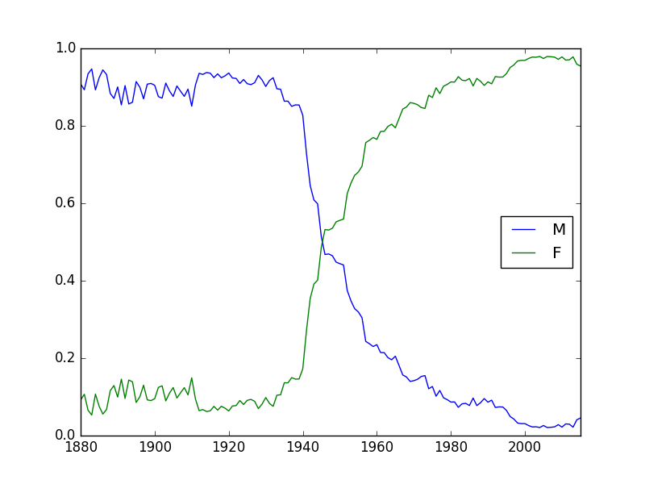
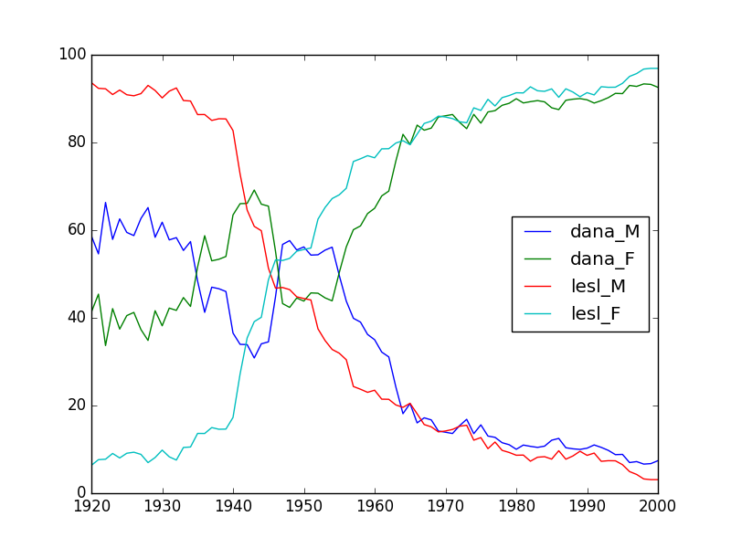
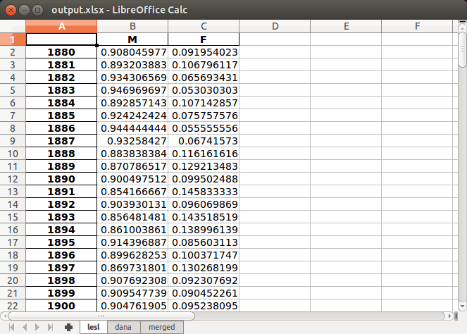

DataFrame Processing with FunctionNode and PipeNode
===================================================

The ``FunctionNode`` and ``PipeNode`` were built in large part to handle data processing pipelines with Pandas ``Series`` and ``DataFrame``. The following examples do simple things with data, but provide a framework that can be expanded to meet a wide range of needs.

Sample Data
-----------

Following an example in Wes McKinney's *Python for Data Analysis, 2nd Edition* (2017), these examples will use U.S. child birth name records from the Social Security Administration. Presently, this data is found at the following URL. We will write Python code to automatically download this data.

https://www.ssa.gov/oact/babynames/names.zip

DataFrame Processing with FunctionNode
--------------------------------------

``FunctionNode``-wraped functions can be used to link functions in linear compositions. What is passed in the pipes can change, as long as a node is prepared to receive the value of its predecessor. As before, *core callables* are called only after the complete composition expression is evaluated to a single function and called with the *initial input*.

We will use the follow imports throughout these examples. The ``requests`` and ``pandas`` third-party packages are easily installed with ``pip``.

.. code-block:: python
    :class: copy-button

    import collections
    import os
    import webbrowser
    import zipfile

    import requests
    import pandas as pd
    import function_pipe as fpn

We will introduce the ``FunctionNode`` decorated functions one at a time. We start with a function that, given a destination file path, will download the dataset (if it does not already exist), read the zip, and load the data into an ``OrderedDictionary`` of ``DataFrame`` keyed by year. Each ``DataFrame`` has a column for "name", "gender", and "count". We will for now store the URL as a module-level constant.

.. code-block:: python
    :class: copy-button

    URL_NAMES = "https://www.ssa.gov/oact/babynames/names.zip"
    FP_ZIP = "unzipped_names.txt"

    @fpn.FunctionNode
    def load_data_dict(fp):

        if not os.path.exists(fp):
            r = requests.get(URL_NAMES)

            with open(fp, "wb") as f:
                f.write(r.content)

        data_dict = collections.OrderedDict()
        with zipfile.ZipFile(fp) as zf:
            for zip_info in sorted(zf.infolist(), key=lambda zip_info: zip_info.filename):
                filename = zip_info.filename

                if filename.startswith("yob"):
                    year = int(filename[3:7])
                    df = pd.read_csv(
                        zf.open(zip_info),
                        header=None,
                        names=("name", "gender", "count"),
                    )
                    data_dict[year] = df

        return data_dict

Next, we have a function that, given that same dictionary, produces a single ``DataFrame`` that lists, for each year, the total number of males and females recorded with columns for "M" and "F". Notice that the approach used below strictly requires the usage of an ``OrderedDictionary``.

.. code-block:: python
    :class: copy-button

    @fpn.FunctionNode
    def gender_count_per_year(data_dict):
        records = []
        for year, df in data_dict.items():
            male = df[df["gender"] == "M"]["count"].sum()
            female = df[df["gender"] == "F"]["count"].sum()
            records.append((male, female))

        return pd.DataFrame.from_records(
            records,
            index=data_dict.keys(), # ordered
            columns=("M", "F"),
        )

Given row data that represent parts of whole, a utility function can be used to convert the previously created ``DataFrame`` into percent floats.

.. code-block:: python
    :class: copy-button

    @fpn.FunctionNode
    def percent(df):
        result = pd.DataFrame(index=df.index)
        total = df.sum(axis=1)
        for column in df.columns:
            result[column] = df[column] / total
        return result

A utility function can be used to select a contiguous year range from a ``DataFrame`` indexed by integer year values. We expect the ``start`` and ``end`` parameters to provided through partialing, and the ``DataFrame`` to be provided from the *predecessor return* value:

.. code-block:: python
    :class: copy-button

    @fpn.FunctionNode
    def year_range(df, start, end):
        return df.loc[start:end]

We can plot any ``DataFrame`` using Pandas' interface to ``matplotlib`` (which will need to be installed and configured separately). The function takes an optional argument for destination file path and returns the same path after writing an image file.

.. code-block:: python
    :class: copy-button

    @fpn.FunctionNode
    def plot(df, fp="/tmp/plot.png"):
        ax = df.plot()
        ax.get_figure().savefig(fp)
        return fp

Finally, to open the resulting plot for viewing, we will use Python's ``webbrowser`` module.

.. code-block:: python
    :class: copy-button

    @fpn.FunctionNode
    def open_plot(fp):
        webbrowser.open(fp)

With all functions decorated as ``FunctionNode``, we can create a composition expression. The partialed ``start`` and ``end`` arguments permit selecting different year ranges. Notice that the data passed between nodes changes, from an ``OrderedDict`` of ``DataFrame``, to a ``DataFrame``, to a file path string. To call the composition expression ``f``, we simply pass the necessary argument of the *innermost* ``load_data_dict`` function.

.. code-block:: python
    :class: copy-button

    f = (
        load_data_dict
        >> gender_count_per_year
        >> year_range.partial(start=1950, end=2000)
        >> percent
        >> plot
        >> open_plot
    )

    f(FP_ZIP)

.. image:: _static/usage_df_plot-a.png

If, for the sake of display, we want to convert the floating-point percents to integers before ploting, we do not need to modify the ``FunctionNode`` implementation. As ``FunctionNode`` support operators, we can simply scale the output of the ``percent`` ``FunctionNode`` by 100.

.. code-block:: python
    :class: copy-button

    f = (
        load_data_dict
        >> gender_count_per_year
        >> year_range.partial(start=1950, end=2000)
        >> (percent * 100)
        >> plot
        >> open_plot
    )

    f(FP_ZIP)

.. image:: _static/usage_df_plot-b.png

While this approach is illustrative, it is limited. Using simple linear composition, as above, it is not possible with the same set of functions to produce multiple plots with the same data, or both write plots and output ``DataFrame`` data in Excel. This and more is possible with ``PipeNode``.

DataFrame Processing with PipeNode
----------------------------------

Building on the tutorial from earlier (LINK NEEDED), we will now expore processing dataframes using ``fpn.PipeNodes``.

While not required to use pipelines, is is useful to create a ``PipeNodeInput`` subclass that will share state across the pipeline.

The following implementation of a ``PipeNodeInput`` subclass stores the URL as the class attribute ``URL_NAMES``, and stores the ``output_dir`` argument as an instance attribute. The ``load_data_dict`` function is essentially the same as before, though here it is a ``classmethod`` that reads ``URL_NAMES`` from the class. The resulting ``data_dict`` instance attribute is stored in the ``PipeNodeInput``, making it available to every node.

.. code-block:: python
    :class: copy-button

    class PNI(fpn.PipeNodeInput):

        URL_NAMES = "https://www.ssa.gov/oact/babynames/names.zip"

        @classmethod
        def load_data_dict(cls, fp):

            if not os.path.exists(fp):
                r = requests.get(cls.URL_NAMES)
                with open(fp, "wb") as f:
                    f.write(r.content)

            data_dict = collections.OrderedDict()
            with zipfile.ZipFile(fp) as zf:
                for zip_info in sorted(zf.infolist(), key=lambda zip_info: zip_info.filename):
                    filename = zip_info.filename

                    if filename.startswith("yob"):
                        year = int(filename[3:7])
                        df = pd.read_csv(
                                zf.open(zip_info),
                                header=None,
                                names=("name", "gender", "count"))
                        data_dict[year] = df

            return data_dict

        def __init__(self, output_dir):
            super().__init__()
            self.output_dir = output_dir
            fp_zip = os.path.join(output_dir, "names.zip")
            self.data_dict = self.load_data_dict(fp_zip)

We can generalize the ``gender_count_per_year`` function from above to count names per gender per year. Names often have variants, so we can match names with a passed-in function ``name_match``. As this node takes an *expression-level argument*, we decorate it with ``pipe_node_factory``. Setting this function to ``lambda n: True`` results in exactly the same functionality as the ``gender_count_per_year`` function. Recall how we can access ``data_dict`` from the positionally bound ``pni`` argument.

.. code-block:: python
    :class: copy-button

    @fpn.pipe_node_factory(fpn.PN_INPUT)
    def name_count_per_year(pni, name_match):
        records = []

        for year, df in pni.data_dict.items():
            counts = collections.OrderedDict()
            name_selection = df["name"].apply(name_match)

            for gender in ("M", "F"):
                gender_selection = (df["gender"] == gender) & name_selection
                counts[gender] = df[gender_selection]["count"].sum()

            records.append(tuple(counts.values()))

        return pd.DataFrame.from_records(
            records,
            index=pni.data_dict.keys(), # ordered
            columns=("M", "F"),
        )

A number of functions used above as ``FunctionNode`` can be recast as ``PipeNode`` by simpy binding ``fpn.PREDECESSOR_RETURN`` as the first positional argument. Recall that PNs that need *expression-level arguments* are decorated with ``pipe_node_factory``. The ``plot`` node now takes a ``file_name`` argument, to be combined with the output directory set in the ``PipeNodeInput`` instance.

.. code-block:: python
    :class: copy-button

    @fpn.pipe_node(fpn.PREDECESSOR_RETURN)
    def percent(df):
        result = pd.DataFrame(index=df.index)
        total = df.sum(axis=1)

        for column in df.columns:
            result[column] = df[column] / total

        return result

    @fpn.pipe_node_factory(fpn.PREDECESSOR_RETURN)
    def year_range(df, start, end):
        return df.loc[start:end]

    @fpn.pipe_node_factory(fpn.PN_INPUT, fpn.PREDECESSOR_RETURN)
    def plot(pni, df, file_name): # now we can pass a file name
        fp = os.path.join(pni.output_dir, file_name)
        ax = df.plot()
        ax.get_figure().savefig(fp)
        return fp

    @fpn.pipe_node(fpn.PREDECESSOR_RETURN)
    def open_plot(fp):
        webbrowser.open(fp)

With these nodes defined, we can create many differnt processing pipelines. For example, to plot two graphs, one each for the distribution of names that start with "lesl" and "dana", we can create the following expression. Notice that, for maximum efficiency, ``load_data_dict`` is called only once in the ``PipeNodeInput``. Further, now that ``plot`` takes a file name argument, we can uniquely name our plots.

.. code-block:: python
    :class: copy-button

    f = (
        name_count_per_year(lambda n: n.lower().startswith("lesl"))
        | percent
        | plot("lesl.png")
        | open_plot
        | name_count_per_year(lambda n: n.lower().startswith("dana"))
        | percent
        | plot("dana.png")
        | open_plot
    )

    f[PNI("/tmp")]

.. image:: _static/usage_df_plot-dana-a.png

To support graphing the gender distribution for multiple names simultaneously, we can create a specialized node to merge ``PipeNode`` expressions passed as key-word arguments. We will then merge all those ``DataFrame`` key-value pairs.

.. code-block:: python
    :class: copy-button

    @fpn.pipe_node_factory(fpn.PN_INPUT)
    def merge_gender_data(pni, **kwargs):
        df = pd.DataFrame(index=pni.data_dict.keys())
        for k, v in kwargs.items():
            for gender in ("M", "F"):
                df[k + "_" + gender] = v[gender]
        return df

Now we can create two expressions for each name we are investigating. These are then passed to ``merge_gender_data`` as key-word arguments. In all cases the raw data ``DataFrame`` is now retained with the ``store`` ``PipeNode``. After plotting and viewing, we can retrieve and iterate over stored keys and ``DataFrame`` by calling the ``store_items`` method of ``PipeNodeInput``. In this example, we load each ``DataFrame`` into a sheet of an Excel workbook.

.. code-block:: python
    :class: copy-button

    lesl_pipeline = (
        name_count_per_year(lambda n: n.lower().startswith("lesl"))
        | percent
        | fpn.store("lesl")
    )

    dana_pipeline = (
        name_count_per_year(lambda n: n.lower().startswith("dana"))
        | percent
        | fpn.store("dana")
    )

    f = (
        merge_gender_data(lesl=lesl_pipeline, dana=dana_pipeline)
        | year_range(1920, 2000)
        | fpn.store("merged") * 100
        | plot("gender.png")
        | open_plot
    )

    pni = PNI("/tmp")
    f[pni]

    xlsx = pd.ExcelWriter(os.path.join(pni.output_dir, "output.xlsx"))
    for k, df in pni.store_items():
        df.to_excel(xlsx, k)
    xlsx.save()

These examples demonstrate organizing data processing routines with ``PipeNode`` expressions. Using ``PipeNodeInput`` sublcasses, data acesss routines can be centralized and made as efficient as possible. Further, ``PipeNodeInput`` sublcasses can provide common parameters, such as output directories, to all nodes. Finally, the results of sub-expressions can be stored and recalled within ``PipeNode`` expressions, or extracted after ``PipeNode`` execution for writing to disk.

Appendix
---------

Code shown in this tutorial:

.. code-block:: python
    :class: copy-button

    import collections
    import os
    import webbrowser
    import zipfile

    import requests
    import pandas as pd
    import function_pipe as fpn

    URL_NAMES = "https://www.ssa.gov/oact/babynames/names.zip"
    FP_ZIP = "unzipped_names.txt"

    @fpn.FunctionNode
    def load_data_dict(fp):

        if not os.path.exists(fp):
            r = requests.get(URL_NAMES)

            with open(fp, "wb") as f:
                f.write(r.content)

        data_dict = collections.OrderedDict()
        with zipfile.ZipFile(fp) as zf:
            for zip_info in sorted(zf.infolist(), key=lambda zip_info: zip_info.filename):
                filename = zip_info.filename

                if filename.startswith("yob"):
                    year = int(filename[3:7])
                    df = pd.read_csv(
                        zf.open(zip_info),
                        header=None,
                        names=("name", "gender", "count"),
                    )
                    data_dict[year] = df

        return data_dict

    @fpn.FunctionNode
    def gender_count_per_year(data_dict):
        records = []
        for year, df in data_dict.items():
            male = df[df["gender"] == "M"]["count"].sum()
            female = df[df["gender"] == "F"]["count"].sum()
            records.append((male, female))

        return pd.DataFrame.from_records(
            records,
            index=data_dict.keys(), # ordered
            columns=("M", "F"),
        )

    @fpn.FunctionNode
    def percent(df):
        result = pd.DataFrame(index=df.index)
        total = df.sum(axis=1)
        for column in df.columns:
            result[column] = df[column] / total
        return result

    @fpn.FunctionNode
    def year_range(df, start, end):
        return df.loc[start:end]

    @fpn.FunctionNode
    def plot(df, fp="/tmp/plot.png"):
        ax = df.plot()
        ax.get_figure().savefig(fp)
        return fp

    @fpn.FunctionNode
    def open_plot(fp):
        webbrowser.open(fp)

    # Example 1:

    f = (
        load_data_dict
        >> gender_count_per_year
        >> year_range.partial(start=1950, end=2000)
        >> percent
        >> plot
        >> open_plot
    )

    f(FP_ZIP)

    # Example 2:

    f = (
        load_data_dict
        >> gender_count_per_year
        >> year_range.partial(start=1950, end=2000)
        >> (percent * 100)
        >> plot
        >> open_plot
    )

    f(FP_ZIP)

    # Example 3:

    class PNI(fpn.PipeNodeInput):

        URL_NAMES = "https://www.ssa.gov/oact/babynames/names.zip"

        @classmethod
        def load_data_dict(cls, fp):

            if not os.path.exists(fp):
                r = requests.get(cls.URL_NAMES)
                with open(fp, "wb") as f:
                    f.write(r.content)

            data_dict = collections.OrderedDict()
            with zipfile.ZipFile(fp) as zf:
                for zip_info in sorted(zf.infolist(), key=lambda zip_info: zip_info.filename):
                    filename = zip_info.filename

                    if filename.startswith("yob"):
                        year = int(filename[3:7])
                        df = pd.read_csv(
                                zf.open(zip_info),
                                header=None,
                                names=("name", "gender", "count"))
                        data_dict[year] = df

            return data_dict

        def __init__(self, output_dir):
            super().__init__()
            self.output_dir = output_dir
            fp_zip = os.path.join(output_dir, "names.zip")
            self.data_dict = self.load_data_dict(fp_zip)

    @fpn.pipe_node_factory(fpn.PN_INPUT)
    def name_count_per_year(pni, name_match):
        records = []

        for year, df in pni.data_dict.items():
            counts = collections.OrderedDict()
            name_selection = df["name"].apply(name_match)

            for gender in ("M", "F"):
                gender_selection = (df["gender"] == gender) & name_selection
                counts[gender] = df[gender_selection]["count"].sum()

            records.append(tuple(counts.values()))

        return pd.DataFrame.from_records(
            records,
            index=pni.data_dict.keys(), # ordered
            columns=("M", "F"),
        )

    @fpn.pipe_node(fpn.PREDECESSOR_RETURN)
    def percent(df):
        result = pd.DataFrame(index=df.index)
        total = df.sum(axis=1)

        for column in df.columns:
            result[column] = df[column] / total

        return result

    @fpn.pipe_node_factory(fpn.PREDECESSOR_RETURN)
    def year_range(df, start, end):
        return df.loc[start:end]

    @fpn.pipe_node_factory(fpn.PN_INPUT, fpn.PREDECESSOR_RETURN)
    def plot(pni, df, file_name): # now we can pass a file name
        fp = os.path.join(pni.output_dir, file_name)
        ax = df.plot()
        ax.get_figure().savefig(fp)
        return fp

    @fpn.pipe_node(fpn.PREDECESSOR_RETURN)
    def open_plot(fp):
        webbrowser.open(fp)

    f = (
        name_count_per_year(lambda n: n.lower().startswith("lesl"))
        | percent
        | plot("lesl.png")
        | open_plot
        | name_count_per_year(lambda n: n.lower().startswith("dana"))
        | percent
        | plot("dana.png")
        | open_plot
    )

    f[PNI("/tmp")]

    # Example 4:

    @fpn.pipe_node_factory(fpn.PN_INPUT)
    def merge_gender_data(pni, **kwargs):
        df = pd.DataFrame(index=pni.data_dict.keys())
        for k, v in kwargs.items():
            for gender in ("M", "F"):
                df[k + "_" + gender] = v[gender]
        return df

    lesl_pipeline = (
        name_count_per_year(lambda n: n.lower().startswith("lesl"))
        | percent
        | fpn.store("lesl")
    )

    dana_pipeline = (
        name_count_per_year(lambda n: n.lower().startswith("dana"))
        | percent
        | fpn.store("dana")
    )

    f = (
        merge_gender_data(lesl=lesl_pipeline, dana=dana_pipeline)
        | year_range(1920, 2000)
        | fpn.store("merged") * 100
        | plot("gender.png")
        | open_plot
    )

    pni = PNI("/tmp")
    f[pni]

    xlsx = pd.ExcelWriter(os.path.join(pni.output_dir, "output.xlsx"))
    for k, df in pni.store_items():
        df.to_excel(xlsx, k)
    xlsx.save()
